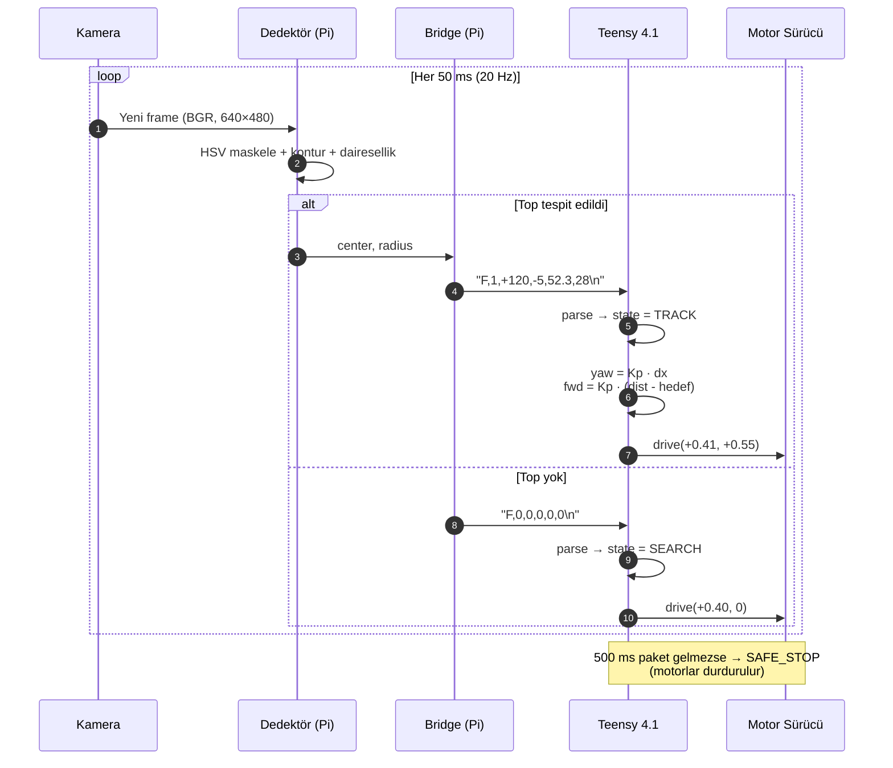
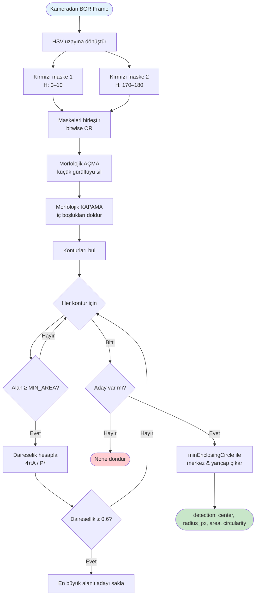
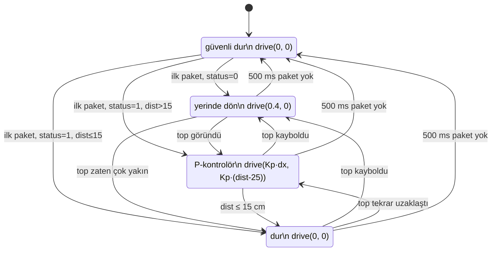
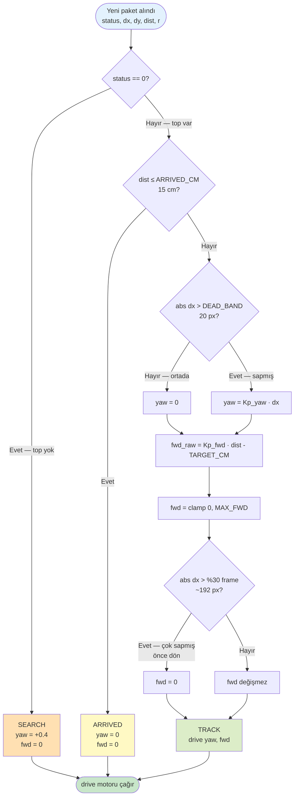
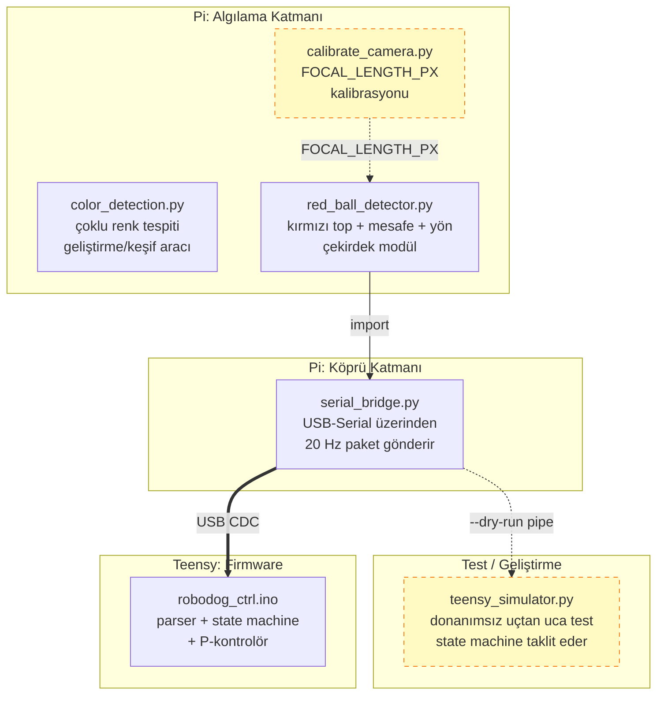
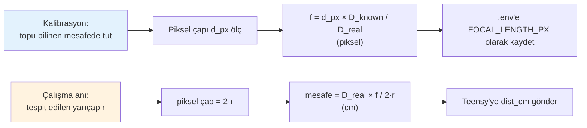

# Robodog — Sistem Diyagramları (Tez Eki)

Bu dosya, robotun görsel algılama ve hareket kontrol sisteminin
tüm akış, mimari ve durum diyagramlarını içerir. Diyagramlar
[Mermaid](https://mermaid.js.org/) formatında yazılmıştır.

**Görüntülemek / dışa aktarmak için:**
- [mermaid.live](https://mermaid.live) → blokları yapıştır → PNG/SVG indir
- VS Code'da **Markdown Preview Mermaid Support** eklentisi → otomatik render
- Tez Word/LaTeX dosyasına: PNG olarak export et, görsel olarak ekle


---

## 1. Genel Sistem Mimarisi

Donanım bileşenleri ve veri yolları. İki ana işlemci (Raspberry Pi 4
ve Teensy 4.1) USB-Serial ile haberleşir; her birinin sorumluluk
alanı net olarak ayrılmıştır.

```mermaid
graph LR
    subgraph PI["Raspberry Pi 4 - Görsel Algılama"]
        CAM[Camera Module 2<br/>640x480 @ 30 fps]
        DET[Kırmızı Top Dedektörü<br/>HSV + Daireselik Filtresi]
        BRG[Serial Bridge<br/>20 Hz paket]
    end

    subgraph TEENSY["Teensy 4.1 - Hareket Kontrol"]
        PARSE[CSV Parser]
        SM[Durum Makinesi<br/>SEARCH / TRACK<br/>ARRIVED / SAFE_STOP]
        PID[P-Kontrolör<br/>yaw, forward]
        IK[Ters Kinematik<br/>4 bacak]
    end

    subgraph MOTOR["Motor Sürücü Katmanı"]
        DRV[Motor Sürücüler]
        LEGS[12 x Eklem Servosu<br/>4 bacak × 3 DOF]
    end

    CAM -->|libcamera frame| DET
    DET -->|merkez, yarıçap| BRG
    BRG ==>|USB-Serial CSV<br/>F,status,dx,dy,dist,r| PARSE
    PARSE --> SM
    SM --> PID
    PID --> IK
    IK -->|PWM| DRV
    DRV --> LEGS

    classDef pi fill:#e3f2fd,stroke:#1976d2
    classDef teensy fill:#fff3e0,stroke:#e65100
    classDef motor fill:#f3e5f5,stroke:#6a1b9a
    class CAM,DET,BRG pi
    class PARSE,SM,PID,IK teensy
    class DRV,LEGS motor
```



**Tasarım kararı:** Görsel işleme Pi tarafında, kontrol mantığı Teensy
tarafında bırakılmıştır. Bu ayrım sayesinde Pi çöktüğünde Teensy
watchdog ile durur — bacaklar son komutla kontrolsüz hareket etmez.


---

## 2. Veri Akışı (Sıralı Diyagram)

Bir saniyelik tipik çalışma periyodu. 20 Hz frekansında Pi, görüş
raporunu Teensy'ye iletir; Teensy de o ana ait motor komutunu üretir.




---

## 3. Algılama Boru Hattı (Detection Pipeline)

Bir framedeki kırmızı topun bulunması için izlenen adım dizisi.
HSV renk uzayında çift aralık maskeleme ile kırmızının açısal
sarmalı (0–10° ve 170–180°) ele alınır.



**Neden iki kırmızı maske?** HSV uzayında kırmızı, açısal olarak
0° ve 180° civarında sarmalanır. Tek aralık yeterli değildir;
iki aralığın `OR`'u alınır.

**Daireselik filtresi:** Çevre uzunluğu `P` ve alan `A` için
`(4·π·A) / P²` formülü hesaplanır. Mükemmel daire için bu oran
**1.0**'dır. 0.6 eşiği topu yakalarken kırmızı kıyafet/kazak gibi
düzensiz şekilleri eler.


---

## 4. Durum Makinesi (State Machine — Teensy)

Robotun davranış durumları ve geçiş koşulları. Sistem her zaman
güvenli durumda başlar; veri akışı düzgün olduğunda diğer
durumlara geçer.



**Watchdog mekanizması:** Pi'den son paket geleli 500 ms geçtiyse
hangi durumda olursa olsun `SAFE_STOP`'a düşülür. Bu sayede Pi
yazılımı çökse veya USB kablosu çıksa bile robot kontrolsüz hareket
etmez — yerinde durur.


---

## 5. Kontrol Karar Akışı (P-Controller)

Teensy yeni bir paket aldığında izlediği karar şeması. Çıktı:
`drive(yaw, forward)` çağrısı.



**Tasarım notu — "Önce dön" koruyucusu:** Top çok yan sapmışsa
(|dx| > frame genişliğinin %30'u), ileri komut bastırılır. Bu
sayede robot S-eğrisi çizerek topu kovalamak yerine **önce
yönelir, sonra yaklaşır** — yörünge daha verimli.


---

## 6. Mesaj Formatı (Pi → Teensy)

Pi'den Teensy'ye gönderilen her paketin yapısı:

```
F,<status>,<dx>,<dy>,<dist_cm>,<radius_px>\n
```

| Alan | Tip | Aralık | Anlam |
|---|---|---|---|
| `F` | sabit | — | Frame paketi başlığı (sync) |
| `status` | int | 0 / 1 | 0 = top yok, 1 = top var |
| `dx` | işaretli int | −320 .. +320 | Merkezin yatay sapması (px). `+` sağ |
| `dy` | işaretli int | −240 .. +240 | Merkezin dikey sapması (px). `+` aşağı |
| `dist_cm` | float | 0 / 5–500 | Tahmini mesafe (cm). Top yoksa 0 |
| `radius_px` | int | 0 / 5–200 | Tespit edilen yarıçap (kalite göstergesi) |
| `\n` | sabit | — | Paket sonu |

**Örnek paketler:**

| Paket | Anlam |
|---|---|
| `F,0,0,0,0,0\n` | Top yok |
| `F,1,+120,-5,52.3,28\n` | Top var, 120 px sağda, 52 cm uzakta |
| `F,1,0,0,18.4,75\n` | Top tam ortada, 18 cm — ARRIVED yakın |
| `F,1,-220,+10,95.0,12\n` | Top solda, 95 cm uzakta — önce dön, sonra yaklaş |

**Frekans:** 20 Hz (her 50 ms). Yapılandırılabilir (`BRIDGE_HZ`).

**Bant genişliği:** Ortalama paket ~22 byte → 22 × 20 = **440 byte/s**.
USB CDC tam-hız kanalının (12 Mbit/s = 1.5 MB/s) binde üçü.


---

## 7. Yazılım Bileşenleri Haritası

Proje dizinindeki dosyaların görev/sorumluluk haritası:



**Notlar:**
- `red_ball_detector.py` hem standalone çalışır (kendi `main()`'i var),
  hem de bir Python modülü olarak `serial_bridge.py` tarafından
  import edilir.
- `teensy_simulator.py` Teensy firmware'inin Python karşılığıdır —
  aynı sabit ve mantıkları kullanır. Donanım gelmeden tüm zincirin
  test edilmesini sağlar.


---

## 8. Mesafe Tahmini — Geometrik Formül

Tek kameralı sistemde topun mesafesinin tahmini, bilinen-çap
yönteminden türetilir. Kalibrasyon adımı `calibrate_camera.py`
ile odak uzaklığı (`f`, piksel cinsinden) hesaplanır.



Formül özeti:

| Sembol | Anlam |
|---|---|
| D_real | Topun gerçek çapı (cm, sabit) |
| D_known | Kalibrasyon sırasındaki bilinen mesafe (cm) |
| d_px | O mesafedeki ölçülen piksel çap |
| f | Hesaplanan odak uzaklığı (piksel) |
| r | Çalışma anındaki yarıçap (piksel) |

**Çıkış denklemi:**

```
mesafe (cm) = (D_real × f) / (2 × r)
```


---

## 9. Sistem Çalışma Modları

```mermaid
flowchart TB
    subgraph DEV["Geliştirme Modu (Teensy yok)"]
        D1[python serial_bridge.py --dry-run]
        D2[| python teensy_simulator.py]
        D1 --> D2
    end

    subgraph CAL["Kalibrasyon Modu"]
        C1[python calibrate_camera.py<br/>topu farklı mesafelerde tut<br/>SPACE ile ölç]
        C2[ortalama FOCAL_LENGTH_PX'i .env'e yaz]
        C1 --> C2
    end

    subgraph PROD["Üretim Modu (Teensy bağlı)"]
        P1[Teensy: robodog_ctrl.ino upload]
        P2[Pi: python serial_bridge.py]
        P1 --> P2
    end

    CAL -.->|FOCAL_LENGTH_PX| PROD
    DEV -.->|davranış doğrulama| PROD

    classDef dev fill:#fff9c4
    classDef cal fill:#bbdefb
    classDef prod fill:#c8e6c9
    class D1,D2 dev
    class C1,C2 cal
    class P1,P2 prod
```


---

## Render & Export İpuçları

**Tez için yüksek çözünürlüklü PNG/SVG:**
1. [mermaid.live](https://mermaid.live) sayfasını aç
2. Diyagramın `` ```mermaid ... ``` `` bloğunu kopyala yapıştır
3. Sağ üstten **Actions → PNG/SVG** ile indir
4. SVG tercih et — tez baskısında vektörel kalır, kalitesi düşmez

**Toplu export (komut satırı, opsiyonel):**
```bash
npm install -g @mermaid-js/mermaid-cli
mmdc -i tez_diagramlari.md -o diagrams.pdf
```
